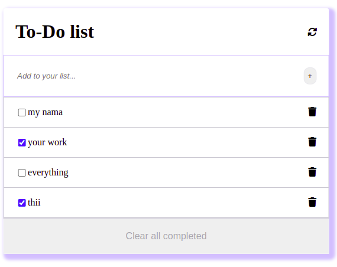

# To-Do list
In this app a user is able to add, remove and edit any task.
He can click on the checkbox to make sure the task is completed
He can finally use the clear button to remove the checked tasks.


# To-Do list-testing:

> Test By Jest 

.

## Built With

- HTML
- CSS
- JavaScript ES6/Modules
- Webpack
- Visual Studio Code.
- Linters
- Testing By jest

## Live Demo

[github page](https://github.com/moise-mulungu/To-Do-list)

[live demo](https://moise-mulungu.github.io/To-Do-list/)

## Getting Started

To get a local copy of this app you can use :
```
git clone  https://github.com/moise-mulungu/To-Do-list
```
To make how it works, use webpack dev-server from your local.


## Author

👤 **Moise Mulungu**

- GitHub: [Moise Mulungu](https://github.com/moise-mulungu)
- Twitter: [Moise Mulungu](https://twitter.com/moise_mulungu)
- LinkedIn: [Moise Mulungu](https://www.linkedin.com/in/mo%C3%AFse-mulungu-a939831b2/)

👤  **Beyk**
- GitHub: [Beyk](https://github.com/beyk)
- Twitter: [Beyk](https://twitter.com/beyk_a)
- LinkedIn: [Beyk](https://www.linkedin.com/in/asghar-beykmohammadi-1b16b291/)

👤 **Stanley SIMEON**
- GitHub: [Stanley Simeon](https://github.com/stanleySimeon)
- Twitter: [Stanley Simeon](https://twitter.com/mstanleyme)
- LinkedIn: [Stanley SIMEON](https://www.linkedin.com/in/stanleySimeon-881091224/)


## 🤝 Contributing

Contributions, issues, and feature requests are welcome!

Feel free to check the [issues page](https://github.com/moise-mulungu/To-Do-list/issues).


## Show your support

Give a ⭐️ if you like this project!

## 📝 License

This project is [MIT](./MIT.md) licensed.
 

